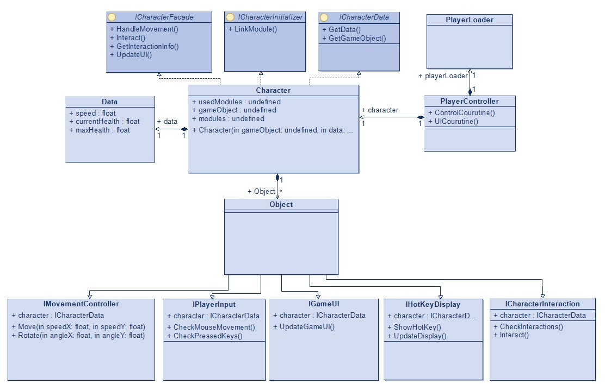
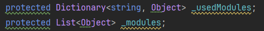
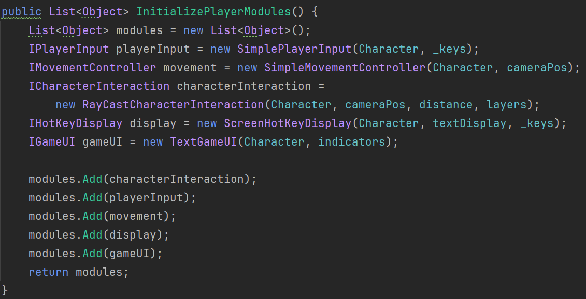
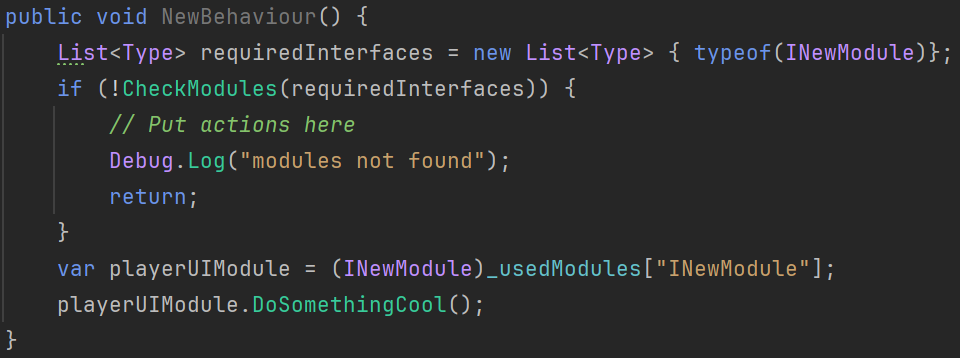
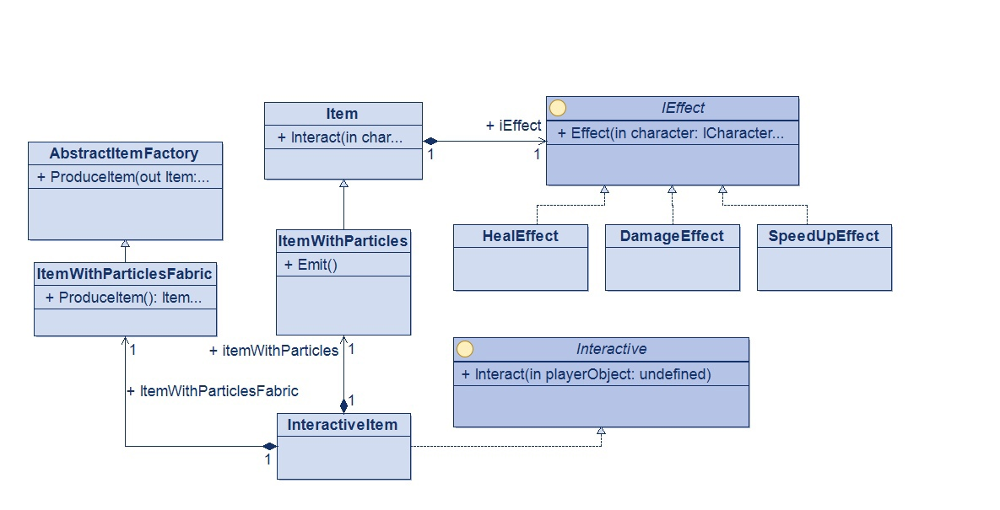
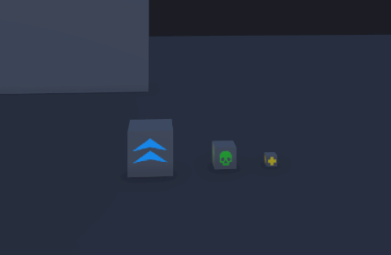

# Тестовое задание "Персонаж"

### Основные папки
- [Код проекта](https://github.com/Oleksey12/Character/tree/master/Assets/Scripts)
- [Готовый билд (Windows)](https://github.com/Oleksey12/Character/tree/master/build)

### Обзор архитектуры персонажа
Скриншот | Текст 
--- | --- 
 | Основным компонентом архитектуры, является класс Character, реализующий паттерн Facade. Он предоставляет простой интерфейс для использования модулей персонажа

Скриншот | Текст 
--- | --- 
 | При этом сам класс не знает заранее, требуемые для его реализации модули, что, во-первых, уменьшает связность класса и модулей, а, во-вторых, позволяет добавлять/подменять модули в рантайме

Скриншот | Текст 
--- | --- 
 | CharacterLoader инициализирует и устанавливает зависимости всех классов персонажа

**Алгоритм расширения фасада**

0. Предположим, что мы хотим добавить в существующий фасад функцию NewBehaviour, основанную на модуле с интерфейсом INewModule. Чтобы добавить эту функцию в интерфейс нужно:
1. Добавить эту функцию в существующий интерфейс ICharacterFacade, либо создать новый mixin интерфейс с сигнатурой этой функции
2.  Создать список с типами интерфейсов модулей, которые требуются для работы функции. В данном случае он будет содержать только тип typeof(INewModule)
3. Добавить проверку наличия использованных в функции модулей. CheckModules(*созданный список*)
4. Достать и распокавать из хэш-таблицы требуемые модули. (INewModule)_usedModules["INewModule"]
5. Добавить логику взаимодействия с модулем
6. *Привязать этот модуль в CharacterLoader, если он ещё не привязан

**Таким образом, код созданной функции будет выглядеть так:**

При этом предыдщуий код фасада не будет затронут совершенно

### Интерактивные предметы
Скриншот | Текст 
--- | --- 
 | Логика интерактивного предмета реализована по паттерну стратегия. Эффект предмета определяется хранимой реализацией интерфейса IEffect

Скриншот | Текст 
--- | --- 
 | Было реализовано 3 эффекта предмета, а также 3 вида предмета (большой, средний и маленький)

